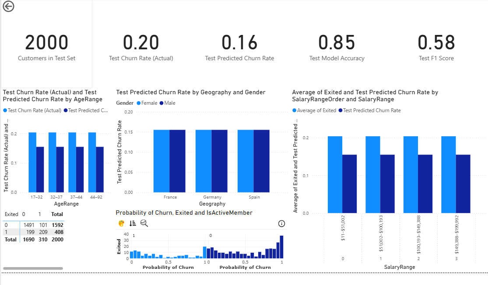

# Bank Customer Churn Prediction using XGBoost and Power BI Dashboard

## Project Overview
Customer churn is a critical issue for banks and financial institutions: retaining customers is more cost-effective than acquiring new ones.  
This project applies **machine learning (XGBoost)** to predict churn probability and integrates the results into an **interactive Power BI dashboard** for business stakeholders.  

The repo demonstrates a **full ML-to-business pipeline**:
- Data preprocessing & leakage prevention
- Model training & evaluation (test vs. full dataset)
- Enriched predictions with demographic & salary segmentation
- Interactive dashboard with **threshold tuning** to explore precision/recall trade-offs

---

## Repository Structure
```
bank-churn-prediction/
|
├── data/
│ ├── Churn_Modelling.csv # Raw dataset
│ ├── churn_predictions.csv # Final enriched predictions
│ ├── test_set_predictions.csv # Test set predictions (for evaluation)
│
├── dashboard/
│ ├── Bank Churn Analysis.pbix # Power BI dashboard file
│ ├── screenshots/ # Dashboard visuals for README
│ ├── ChurnModel.png
│ ├── ChurnWhole.png
│
├── models/
│ └── xgb_churn_pipeline.joblib # Saved model pipeline
│
├── notebooks/
│ └── exploration_and_model.ipynb # Full notebook (EDA → model → evaluation)
│
├── requirements.txt # Python dependencies
├── README.md # This file
└── .gitignore
```

---

## Data Source
Dataset: [Kaggle – Bank Customer Churn Prediction](https://www.kaggle.com/datasets/radheshyamkollipara/bank-customer-churn)  
~10,000 bank customers with features such as age, geography, account balance, tenure, product usage, and churn label (`Exited`).

---

## Approach
### 1. Data Preparation
- Dropped irrelevant identifiers: `RowNumber`, `CustomerId`, `Surname`
- Removed potential leakage (`Complain`)
- Encoded categorical features (`Geography`, `Gender`, `Card Type`)
- Scaled numerical features
- Engineered **quartile-based ranges**:
  - `AgeRange` (e.g., 21–32, 33–41, …)
  - `SalaryRange` (e.g., $11–$51,002, $51,002–$100,193, …)

### 2. Model
- **XGBoost Classifier** (eval metric: log loss, random_state=42)
- Pipeline with preprocessing + model
- Trained on 80/20 stratified train/test split

### 3. Evaluation
- **Test Set Accuracy**: ~0.87  
- **ROC AUC**: ~0.85 (excellent probability ranking ability)  
- Strong **recall** for churners (82%), ensuring most at-risk customers are detected  
- Some trade-off with precision (58%), acceptable for churn-prevention use cases

### 4. Business Integration
- Predictions exported with:
  - `CustomerId`
  - `Exited` (ground truth)
  - `pred_churn` (prediction)
  - `pred_prob_churn` (probability)
  - `AgeRange` & `SalaryRange` + sorting columns
- Served into a **Power BI dashboard** for exploration

---

## Results & Dashboard

### 1. Churn Overview
Churn vs. retention rates, accuracy, recall, and precision metrics visualized.  



### 2. Segmentation
- Churn by **AgeRange**  
- Churn by **SalaryRange**  
- Churn by **Geography**  

---

## Test Set Performance

| Metric      | Class 0 (Stayed) | Class 1 (Churned) | Overall |
|-------------|------------------|-------------------|---------|
| Precision   | 0.88             | 0.67              | —       |
| Recall      | 0.94             | 0.51              | —       |
| F1-score    | 0.91             | 0.58              | —       |
| Accuracy    | —                | —                 | **0.85** |
| ROC AUC     | —                | —                 | **0.847** |

**Confusion Matrix (Test Set):**

| Result      | Pred 0 | Pred 1 |
|-------------|--------|--------|
|Actual 0(No) | 7023   | 939    |
|Actual 1(Yes)| 371    | 1666   |


---

## How to Reproduce
1. Clone the repo:
   ```bash
   git clone https://github.com/MOzaeta96/Bank-Customer-Churn-Dashboard-Creation-Practice.git
   cd bank-churn-prediction

2. Install Dependencies:
   pip install -r requirements.txt

3. Open Notebook:
   jupyter notebook notebooks/exploration_and_model.ipynb
